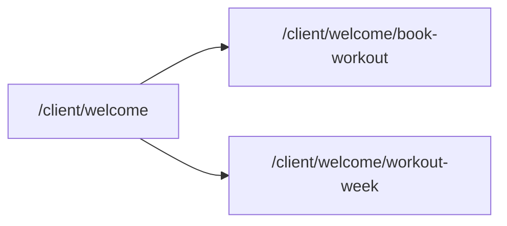

# What happens on the workout-related pages

There is **no single route named `/workout`**. Workout features live under **`/client/welcome/...`** and are reached from the client hub (`src/pages/client/WelcomePage.tsx`) via **Book Workout** and **Workout Week**.

---

## 1. Book Workout — `src/pages/client/dashboard/BookWorkout.tsx`

**Route:** `/client/welcome/book-workout` (`src/router/index.tsx`).

**Purpose:** Pick one of several **scheduled class-style sessions** (Strength, Cardio, Yoga, HIIT) from a **hardcoded** array `availableWorkouts` (coach, time, date, duration, level, location).

**What happens on the page:**

- Lists each session as a card with **Book** / **Booked** / **Cancel** style actions.
- **Book:** `handleBookWorkout` finds the workout, writes **localStorage** key `bookedWorkout` as JSON, opens a **success modal**, then on close adds that workout’s **id** to React state `bookedWorkoutIds` so it shows as booked.
- **Cancel:** Confirmation modal; on confirm removes the id from `bookedWorkoutIds` and may **removeItem("bookedWorkout")** if it matched the stored booking.
- **Navigation:** Back arrow uses **`useNavigate()`** (typically back in history).

**No server:** Booking and cancellation are **client-only**; no API calls.

---

## 2. Workout Week — `src/pages/client/dashboard/WorkoutWeek.tsx`

**Route:** `/client/welcome/workout-week`.

**Purpose:** Show a **7-day plan** from mock data **`WEEKLY_WORKOUTS`** in `src/constants/mockWorkouts.ts` (`WorkoutSession`: day, date, exercises, duration, intensity, coach).

**What happens on the page:**

- Computes **progress** (completed count vs total, %, total hours) from **`completedWorkouts`** (array of session ids).
- **Start session:** `handleStartSession` sets `activeSessionId`, stores **localStorage** `selectedWorkout` = workout id.
- **Finish session:** `handleFinishSession` adds id to `completedWorkouts`, clears `selectedWorkout`, shows a short **toast** with the day name.
- **Timeline bar:** The track is split into **one slice per day**. Each slice is **green** if that day is completed, **red** if skipped, **orange** if that day has the active session (side by side, not one solid green bar). After **Finish**, that day’s slice becomes green.
- **Skipped days:** If a **later** day in the week is already completed or has the **active** session, any **earlier** day that is neither completed nor active is treated as **skipped** (red slice + red dot on the bar, **Skipped** badge on the card). Users can still **Start** that day later to clear the skip.
- UI includes a **timeline/progress** visualization and **per-day cards** with exercises, duration, intensity, coach, and **Start** / **Finish** depending on state.

**No server:** Plan data is **mock**; completion lives in **React state** (resets on full page reload unless you add persistence later).

---

## 3. Other mentions of “workout”

- **Landing:** Marketing copy only (`src/pages/public/LandingPage.tsx`).
- **Coach `MyClients`:** Displays **mock** `lastWorkout` / `workoutsCompleted` per client (`src/constants/mockClients.ts`).
- **Types:** `src/types/index.ts` defines `Workout` / `WorkoutPlan` for future use; the dashboard screens above are driven by **local mocks**, not necessarily those types.

---

## 4. Summary

| Page         | Route              | Data                           | Persistence                                                                 |
| ------------ | ------------------ | ------------------------------ | --------------------------------------------------------------------------- |
| Book Workout | `.../book-workout` | `availableWorkouts` in file    | `bookedWorkout` in localStorage + React state                               |
| Workout Week | `.../workout-week` | `WEEKLY_WORKOUTS` in mock file | `selectedWorkout` in localStorage while a session is active; completion in React state |

**Book Workout** = book/cancel **slots** from a list; **Workout Week** = **weekly plan** with start/finish per day. **Auth** is stubbed (`ProtectedRoute` passes children through) until a backend is integrated.
